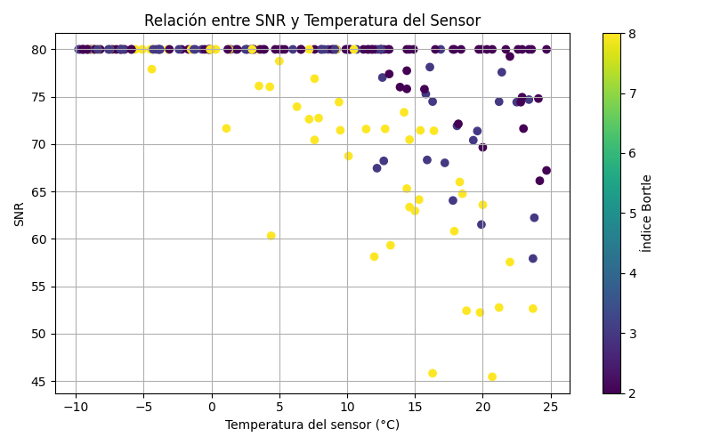

# P06 – Thermal Noise & Dark Frames Study  
### Exploración Comparada: Nikon D7500 vs ASI533MC Pro (Chile, 2019–2025)

## 1. Motivación
Este estudio explora cómo la temperatura del sensor, la contaminación lumínica (Bortle), el tiempo de exposición, el ISO y el número de frames afectan el **SNR final** en astrofotografía de cielo profundo.

## 2. Kit utilizado
- **William Optics RedCat 51 MK2.5**
- **ZWO ASI533MC Pro**
- **Filtro Optolong L-Quad Enhance**
- **Sky-Watcher Star Adventurer GTi**
- **Nikon D7500**
- **ASIAIR Plus**
- **Cintas calefactoras Dew-Heater**
- **GUIA – 30mm + ASI120MM**

## 3. Resultados iniciales
- Cielos oscuros (Atacama) → mayor SNR incluso con menos frames.
- Santiago (Bortle 8) → requiere más de **150 frames** para acercarse al rendimiento del Elqui con ~60.
- La ASI533MC Pro mantiene el ruido térmico controlado aún en noches cálidas.

## 4. Gráficos
### SNR vs Frames  

### SNR vs Temperatura del Sensor  

## 5. Trabajo futuro
- Calibración real con darks de campo.
- Incorporación de flats y bias para datasets controlados.
- Matriz predictiva según objeto (Nebulosa, Cúmulo, Galaxia).
- Integración a ASIAIR (export XML/JSON para recomendaciones automáticas).

## 6. Historial de versiones
- **v0.1 – 2019:** primeras notas desde Santiago.
- **v0.4 – 2021:** pruebas en Elqui, mejoras en dark frames.
- **v0.7 – 2023:** migración a ASI533MC Pro.
- **v1.0 – 2025:** dataset comparativo + modelo SNR.

---

Hugo Baghetti – *Astrofotografía & Data Science*  
Instagram: **@tele.objetivo**  
Web: **www.teleobjetivo.cl**  
OrionLab Research
